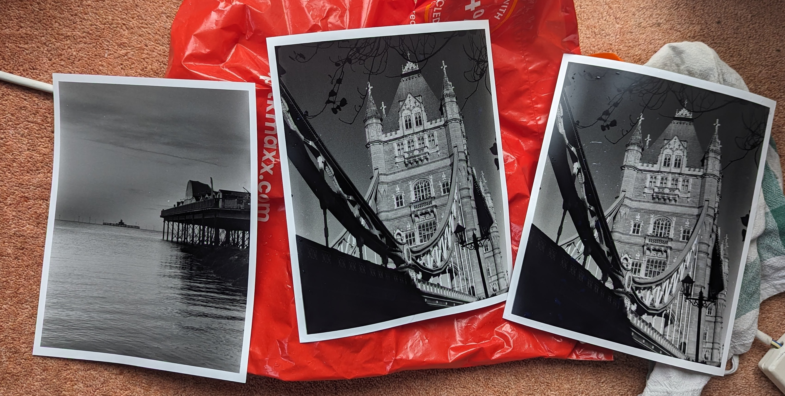
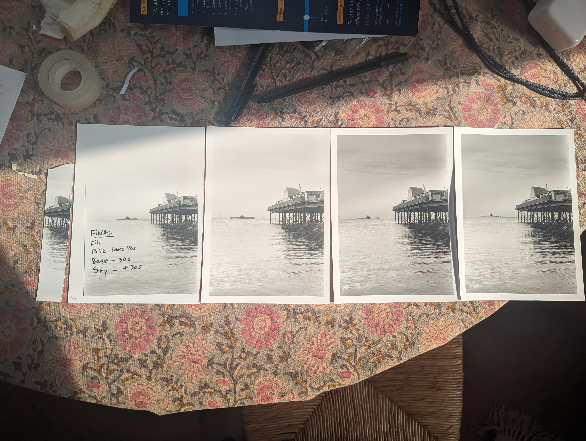
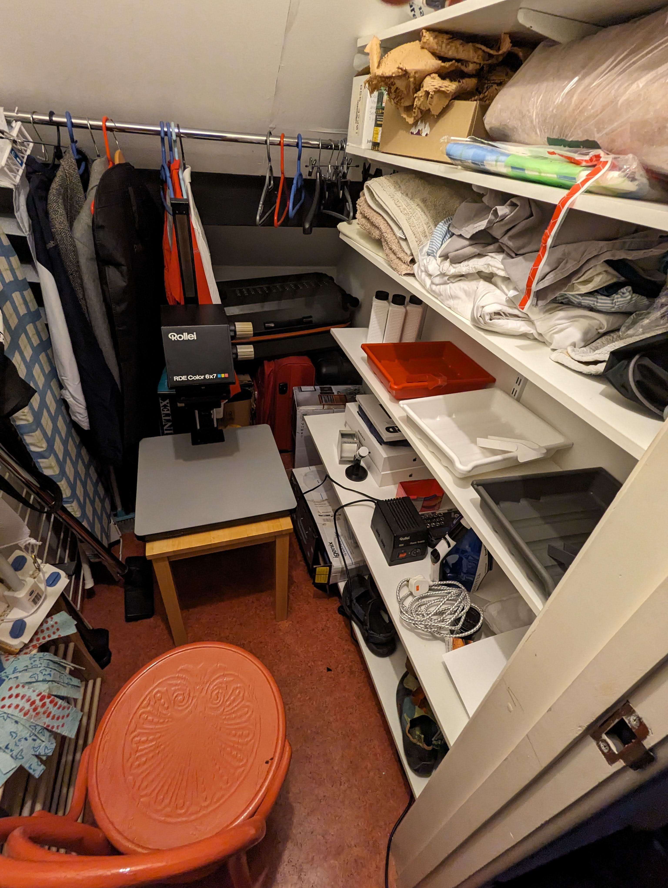

# Entry 4 (18 May 2024)
Time to make large prints! The first print I made was an 8x10 version of the Herne Bay Pier photograph I had previously printed in 5x7. This was also to test the (inverse square) scaling of exposure times. I stopped up one stop to reduce the exposure time by half. The new print does look a bit overexposed though. That could have been due to my shoddy time keeping since I do not have an enlarger timer.

The Tower Bridge photograph is from 2023 and was printed with the following settings:

| Tower Bridge (2023)               |                   |
| ---                               | ---               |
| Paper                             | Ilford Multigrade RC Deluxe Pearl |
| Paper Size                        | 12in x 8in        |
| Aperture                          | F8                |
| Lens (Vertical) Position          | 26.5              |
| Exp Time                          | 94s               | 

# Entry 3 (? May 2024)
I made my first set of prints! I decided to use a photograph I had taken at Herne Bay Pier in 2022.

I didn't position the test strip well enough to get a good sense of the exposure required for the sky. I make the first print by exposing correctly just for the pier and the water. In this print the borders were askew and it was clear that the sky needed to be burned a bit to get details from it. In the next print, I fixed the borders and also added a bit more detail to the sky but burning. However, I wanted to pull out more detail so I decided to burn the sky 1 full stop more than the rest of the image. I was happy with the results. I also wanted to made sure I could repeat it so I made another print which the same parameters. There is some minor variation in exposures at the sky/pier interface. This is the edge of the region I was burning. The setting for this print are:

| Herne Bay Pier (2022)             |                 |
| ---                               | ---               |
| Paper                             | Ilford Multigrade RC Deluxe Pearl |
| Paper Size                        | 5in x 7in       |
| Aperture                          | F11             |
| Lens (Vertical) Position          | 13.5            |
| Base Exp Time                     | 30s             | 
| Sky Additional Exp Time           | +30s            |

# Entry 2 (7 May 2024)
After setting up the darkroom, it was time to run some tests. I had decided to not buy a safelight and instead just an extra red bike light I had lying around. Before I used it in prints, I wanted to make sure that it was indeed "safe". Also, since mine is a color enlarger, it comes with inbuilt color filters. I was curious if the "reddest" filter was "safe". Here are the resutls.

From the top the strips are:
1. Exposed to bike light at actual working distance. It looks like the bike light is indeed safe. I did manage to smudge the paper, presumably beacuse my fingers still had residue from mixing the chemicals.
2. Exposed to bike light at very close distance. Even after being held against the bike light for close to a minute this strip does not darken appreciably. This suggests that the bike light is "very safe".
3. Exposed to the "reddest" filter setting. If this was safe, it would have helped a lot in setting up the negative and paper before exposure. However, the test strip darkened completely with less than a minute of exposure. Clearly, the filtered light from the enlarger is not "safe".
4. This is just a strip I took outside the darkroom for a walk. That it darkened completely just tells me that my chemicals are working.
5. A test strip of a negative with different exposure times.

# Entry 1 (5 May 2024)
I got everything I need to set up my darkroom. I bought the enlarger and the easel on ebay. I bought a kit with chemicals, paper, trays etc from Bristol Cameras. Here is a breakdown of how much I spent:

| Item                                  | Price (£)       |
| ---                                   | ---             |
| Rollei RDE Color 6x7 enlarger         | 51.20           |
| Enlarging Easel                       | 15.21           |
| Darkroom Starter Kit PTP575           | 97.00           | 
| Paterson Large Screen Focus Finder    |  10.00          |
| Paper Guillotine | 8.98 |
| **Total**                             |  **182.39**     |

The store room turned out to be a perfect place to setup the darkroom.

