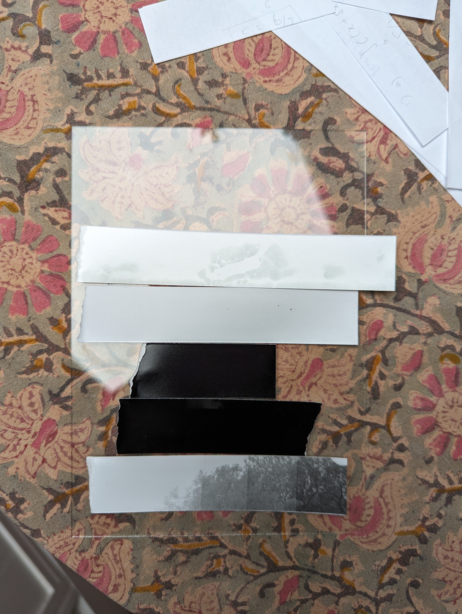

# Entry 2 (7 May 2024)
After setting up the darkroom, it was time to run some tests. I had decided to not buy a safelight and instead just an extra red bike light I had lying around. Before I used it in prints, I wanted to make sure that it was indeed "safe". Also, since mine is a color enlarger, it comes with inbuilt color filters. I was curious if the "reddest" filter was "safe". Here are the resutls.

From the top the strips are:
1. Exposed to bike light at actual working distance. It looks like the bike light is indeed safe. I did manage to smudge the paper, presumably beacuse my fingers still had residue from mixing the chemicals.
2. Exposed to bike light at very close distance. Even after being held against the bike light for close to a minute this strip does not darken appreciably. This suggests that the bike light is "very safe".
3. Exposed to the "reddest" filter setting. If this was safe, it would have helped a lot in setting up the negative and paper before exposure. However, the test strip darkened completely with less than a minute of exposure. Clearly, the filtered light from the enlarger is not "safe".
4. This is just a strip I took outside the darkroom for a walk. That it darkened completely just tells me that my chemicals are working.
5. A test strip of a negative with different exposure times.

# Entry 1 (5 May 2024)
I got everything I need to set up my darkroom. I bought the enlarger and the easel on ebay. I bought a kit with chemicals, paper, trays etc from Bristol Cameras. Here is a breakdown of how much I spent:

| Item                                  | Price (£)       |
| ---                                   | ---             |
| Rollei RDE Color 6x7 enlarger         | 51.20           |
| Enlarging Easel                       | 15.21           |
| Darkroom Starter Kit PTP575           | 97.00           | 
| Paterson Large Screen Focus Finder    |  10.00          |
| Paper Guillotine | 8.98 |
| **Total**                             |  **182.39**     |

The store room turned out to be a perfect place to setup the darkroom.

